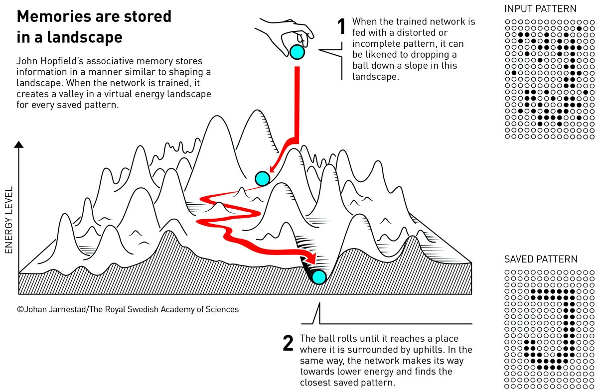
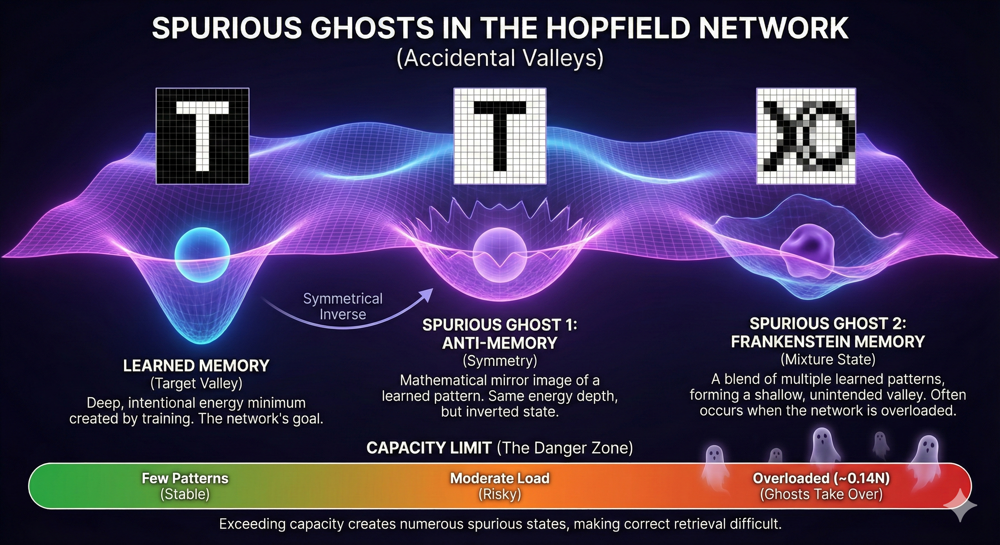
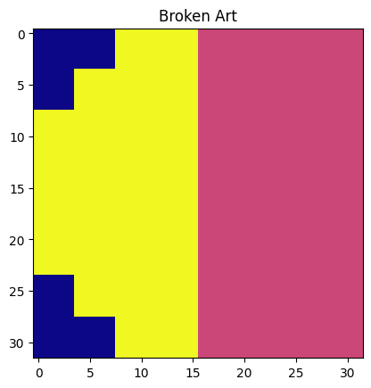
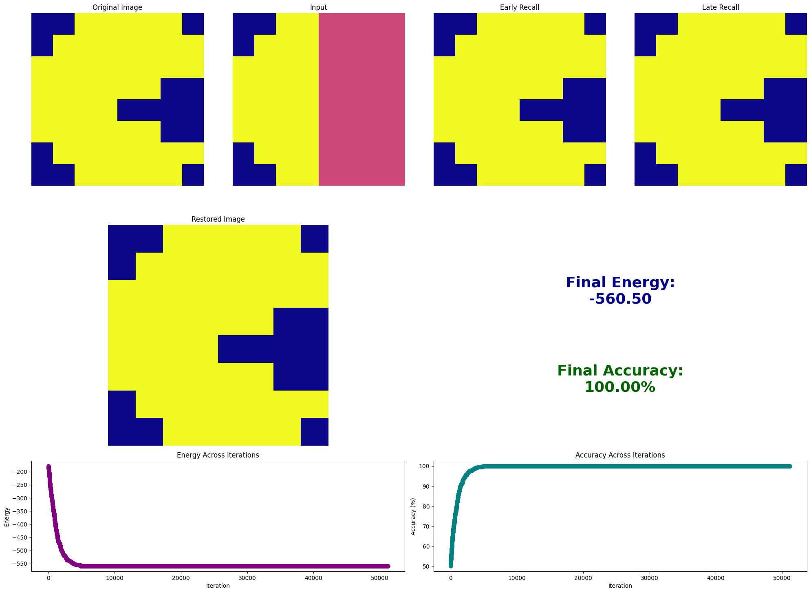
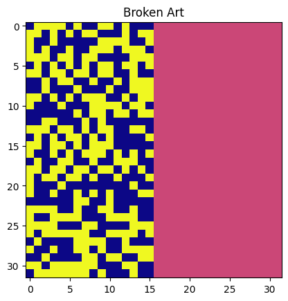
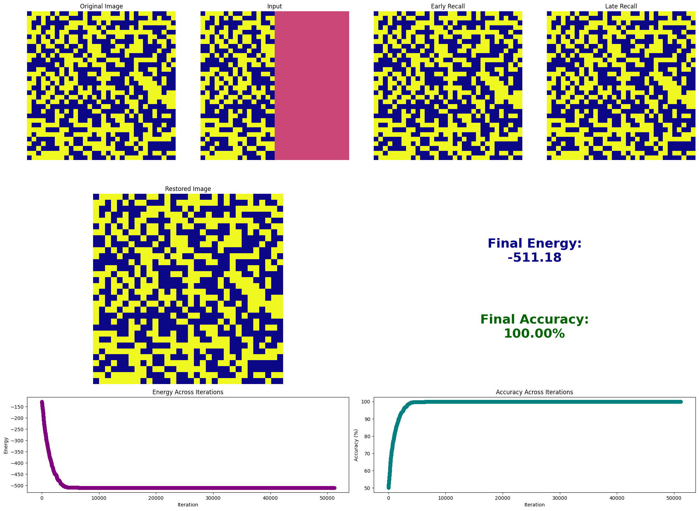
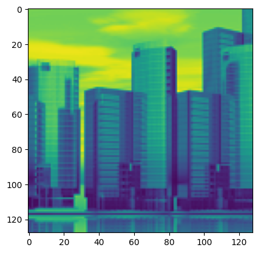
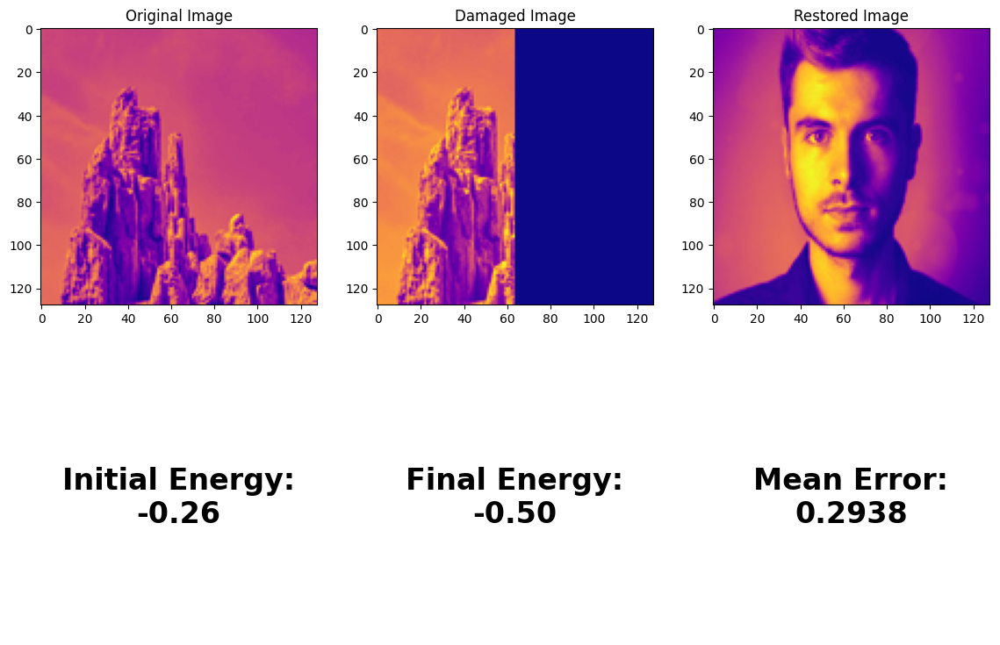

## Hopfield Networks

*Dev Shekhawat*

This notebook demonstrates my experiment with the Hopfield Networks. Named after the american computer scientist [John Hopfield](https://en.wikipedia.org/wiki/John_Hopfield) who won the 2024 physics nobel price for his research on the subject.

> Treat this notebook as an essay that I have written to solidify my understanding on Hopefield Networks and the physics behind it.

#### The biological connection (recalling memories)
Imagine walking through a busy city market on a weekend night. The street is abuzz with activity, but through the noise, you catch the faint sound of a piano drifting from a lively cafe. The melody instantly pulls you down memory lane—back to when your wife first discovered that song and wouldn't stop humming it, testing the absolute limits of your patience.

How did your brain do that? You only heard a fragment of an instrumental melody, yet you instantly recalled the lyrics, the context, and the emotion. Now, before you know it, you can't stop humming it yourself.

When a computer retrieves a memory, the CPU must know the data's exact physical address on the disk. Your brain, however, operates on a completely different architecture. It consists of nearly 86 billion neurons, none of which settle into a permanent, static state. Instead, they constantly activate and deactivate at rapid speeds through electrical bursts known as 'action potentials.' Unlike a hard drive, your brain does not store memories by permanently imprinting them onto a physical medium; the storage is dynamic. How do we model this biological architecture mathematically? We need a system where memories are not found by address, but by content—where a noisy, faint fragment (like that piano melody) is enough to reconstruct the whole. In computer science, this is known as Associative Memory or Content-Addressable Memory. To achieve this, physicist John Hopfield proposed a brilliant idea: he argued that we can treat memories not as data in a drawer, but as stable valleys on an energy surface.



### Valley of a memory
To model this architecture, let's define the memory as a vector consisting of neurons. For simplicity, we will talk about neurons with binary states. Each neuron can either be +1 or -1. Let's say we have $N$ neurons in a memory vector.This implies that the network can exist in $2^N$ possible unique states. For a small $32 \times 32$ pixel image, that is $2^{1024}$ possibilities—a number far larger than the atoms in the observable universe. Most of these states correspond to meaningless random noise. To find our specific memories in this vastness, Hopfield introduced an Energy Function. We configure the connections (weights) between neurons so that the specific patterns we want to store sit at the mathematical "bottom" of the energy landscape. These are the valleys—or basins of attraction.When we present the network with a corrupted or incomplete pattern, we are essentially placing a ball high up on the slopes of this terrain. The network's update dynamics act like gravity, naturally pulling the state down the steepest gradient until it settles into the nearest deep valley. The point where it stops—the stable, minimum-energy state—is the fully restored memory.

In essence, the Energy Function is the compass that guides the network. It assigns a 'score' to every possible configuration of neurons, creating a map where the lowest points (the valleys) are the stable memories we wish to retrieve. To calculate this energy, we need two things:

1. The Current State ($s$): This is the input pattern we are testing. It might be a perfect memory, total noise, or a partial fragment (like our piano melody).
2. The Weight Matrix ($W$): This is the architecture of the network itself. It is not a memory storage box, but a web of connections that encodes the relationships between all the memories simultaneously."

We will come back to the energy part later but first, let's understand how this Weight paramter is calculated.

#### Calculating the weights of the network
The core of the Hopfield network lies in its weights ($W$), which represent the connection strength between any two neurons, $i$ and $j$. In our binary network, where neurons take values of $+1$ or $-1$, the weight matrix is a square grid of size $N \times N$.We calculate these weights using a rule borrowed from neuroscience, famously summarized by Donald Hebb: "Neurons that fire together, wire together." Known as Hebbian Learning, this rule states that if two neurons activate simultaneously, their connection strengthens. In mathematical terms, the weight contribution is simply the product of the two neuron values:Agreement ($+1, +1$ or $-1, -1$): The product is positive ($+1$). The connection is strengthened (excitatory).Disagreement ($+1, -1$): The product is negative ($-1$). The connection is weakened (inhibitory).To calculate the weights for the entire network, we use the Outer Product. For a single memory vector $\mathbf{x}$, the weight matrix is $\mathbf{x}\mathbf{x}^T$. However, since we want to store multiple memories, we sum these matrices together. The final weight matrix $W$ becomes a superposition of all stored patterns:$$W = \frac{1}{N} \sum_{k=1}^{M} \mathbf{x}^{(k)} (\mathbf{x}^{(k)})^T$$(Note: We explicitly set the diagonal $W_{ii} = 0$, as neurons do not connect to themselves).This matrix $W$ serves as the physical archive of our memories. It encapsulates the statistical correlations of every pattern we have ever shown the network, allowing it to reconstruct the whole from a part.

This is an abstract representation of the network with 8 neurons and 64 synapses (connections). Each connection will have a positive or negative weight. For connections with positive weight both neurons will have same activations.


#### Defining the energy
Now that we have the weights, we can define the overall energy of the network. Remember, the value of energy is calculated for a specific state (configuration) of the network. We want to define our energy function in such a way that the energy is minimized for learned memory states and is significantly higher for random patterns.

- **Learned Memory:** The energy is low (the system is stable).
- **Noisy/Faint Pattern:** The energy is high (the system is unstable/under tension).

With this intuition, we can see how the overall energy landscape is a function of $N$ values, where $N$ is the number of neurons. In this high-dimensional landscape, if we stand at a random point, we are at the coordinates of either a stored memory (a valley), random noise (a peak), or somewhere in between.Mathematically, the energy $E$ of a state vector $\mathbf{s}$ is defined as:$$E = -\frac{1}{2} \sum_{i=1}^{N} \sum_{j=1}^{N} W_{ij} s_i s_j$$
Let's break down this formula to see why it works:

1. The Interaction ($W_{ij} s_i s_j$): This term checks for consistency. If two neurons have a positive weight ($W_{ij} > 0$) and they have the same sign ($s_i s_j > 0$), the result is a large positive number. This represents "Harmony."
2. The Negative Sign ($-$): Since we want "Harmony" to correspond to a valley (minimum), we flip the sign. High harmony becomes Low Energy (large negative number).
3. The Halving ($\frac{1}{2}$): Since the summation counts every pair twice (once for $i \to j$ and once for $j \to i$), we divide by 2 to get the true energy of the system.

If you feed the network a noisy version of a memory, the neurons will clash with the weights (disharmony). This results in a high energy value. The network will then naturally flip neurons to lower this energy, sliding down the landscape until it lands in the nearest memory valley.

#### How a noisy input makes the network retrieve a learned memory?

When you feed a noisy input (or a faint memory) to this network, the system effectively comes under "tension."

Remember that because of the weight matrix ($W$), every neuron "knows" what value it *should* have based on the behavior of the neighbors it is connected to. When you introduce a corrupted pattern, many neurons find themselves in states that contradict these learned constraints. This contradiction creates a high-energy, unstable state.

To restore balance and achieve a lower energy, the network initiates a repair process:

##### 1. Asynchronous Updates
The neurons do not update all at once. If every neuron tried to flip simultaneously based on the *current* state of its neighbors, the network could enter an infinite loop of oscillation (constantly flipping back and forth) without ever settling.

Instead, the update happens **asynchronously**—one neuron at a time. The network picks a neuron (randomly or sequentially) and allows it to "decide" its new state. In essence, the neuron does not care about the network as a whole; it only cares about satisfying the local constraints imposed by the weight matrix.

##### 2. The Local "Vote" (The Update Rule)
Since the neuron acts selfishly to satisfy its direct connections, it performs a simple "weighted vote."

Mathematically, a neuron $s_i$ looks at all its neighbors ($s_j$) and calculates a weighted sum to decide its new state:

$$s_i \leftarrow \text{sign}\left(\sum_{j} w_{ij} s_j\right)$$

* **If the sum is positive:** The consensus of the weighted connections says this neuron should be **ON (+1)**.
* **If the sum is negative:** The consensus says it should be **OFF (-1)**.
* **The Flip:** The neuron immediately flips its state to match this consensus.

Intuitively, think of this as **peer pressure**. If your "friends" (positive weights) are active, they drag you up to +1. If your "enemies" (negative weights) are active, they push you down to -1.

##### 3. The Energy Slide (Global Consequence)
Here is where the physics of the Hopfield Network comes in. Even though the neuron made a local decision just to satisfy its neighbors, **it inadvertently lowered the energy of the entire system.**

The "Energy" ($E$) of the network is defined by the amount of "conflict" between neurons:

$$E = -\frac{1}{2} \sum_{i,j} w_{ij} s_i s_j$$

Every time a neuron updates itself to match its neighbors (Step 2), it resolves a local conflict. Mathematically, this guarantees that the Global Energy $E$ decreases (or stays the same). It **never** goes up.

##### 4. Convergence
Because the energy drops with every single flip, the system acts like a ball rolling down a rough hill. It cannot roll forever. Eventually, it must hit a valley—a local minimum.

* When the network reaches this state, every neuron is perfectly aligned with the constraints of its neighbors.
* If any neuron checks its input sum again, it sees that it is already in the correct state. No more flips occur.
* The system freezes.

This "frozen" state is the **Attractor**. Because we constructed the weight matrix using Hebbian learning, this valley corresponds exactly to the **original, clean memory**. The noise has been "shaken out" of the system, and the memory is retrieved.


#### The "Ghost" Memories (Spurious States)

While the Hopfield Network is powerful, it has a haunting side effect. Sometimes, the network converges to a stable state that you **never taught it**. These are called **Spurious States** (or "Ghost Memories").

In our energy landscape analogy, these are "accidental valleys"—places where the ball gets stuck, even though you never dug a hole there.

There are two main types of ghosts in the machine:

##### 1. The "Anti-Memory" (Symmetry)
If the network learns a pattern (e.g., an image of a black circle on white), it *automatically* learns the exact inverse (a white circle on black).

**The Math:**
Look at the energy equation again:
$$E = -\frac{1}{2} \sum_{i,j} w_{ij} s_i s_j$$

If you flip the sign of *every* neuron (change every $+1$ to $-1$ and every $-1$ to $+1$), the product $s_i s_j$ remains exactly the same:
$$(-s_i) \times (-s_j) = s_i s_j$$

Because the energy value doesn't change, the "Anti-Memory" has the exact same depth as the original memory. It is a mathematical mirror image.

##### 2. The "Frankenstein" Memory (Mixture States)
If you teach the network too many patterns, the valleys in the landscape start to interfere with each other.

Imagine you teach it a "Dog" and a "Cat." Ideally, these are two distinct valleys separated by a hill. But if the patterns share too many active neurons (correlation), the valleys might merge. The network might settle in a shallow valley right in the middle—a stable state that looks like a weird, logical mixture of both patterns.



* **Why it happens:** The network is trying to satisfy the constraints of Pattern A *and* Pattern B simultaneously, getting stuck in a local minimum where it partially satisfies both but fully satisfies neither.

#### 3. The Capacity Limit
These ghosts become much more frequent if you overload the network. A standard Hopfield network has a severe storage limit.

* **The Rule of Thumb:** You can only store approximately **0.14N** patterns (where N is the number of neurons) before the "ghosts" take over and the system loses its ability to recall anything correctly. How we came to this number is out of scope for this essay but remember that it is not a magic number, but derived from the rules of statistics.
* For a 100-neuron network, you can only safely store about 14 distinct memories. Beyond that, the energy landscape becomes too rugged, full of false valleys and confusion.

#### Overcoming the limits
This concept of energy landscape and the method of retrieving memories was descriped in Hopfields 1982 paper [Neural networks and physical systems with emergent collective computational abilities.](https://www.pnas.org/doi/10.1073/pnas.79.8.2554) As we saw this model has limits for the number of memories that can be learned.

In 2020, John Hopfield published another paper [LARGE ASSOCIATIVE MEMORY PROBLEM IN NEUROBIOLOGY AND MACHINE LEARNING](https://arxiv.org/pdf/2008.06996) where he proposed a ground breaking solution that exponentially increased the memory limit. We call it a Modern Hopfield Network


```python
import numpy as np
import matplotlib.pyplot as plt
```


```python

```


```python
SIZE = 32
M = 3
```


```python
def show_img(ax, flat_vec):
    ax.imshow(flat_vec.reshape(SIZE, SIZE), cmap='plasma', vmin=-1, vmax=1)
    ax.axis('off')
```


```python
import art

arts, names = art.create_arts()

print("Arts shape:", arts)

selected_arts = arts[:M]

names = [name for _, name in selected_arts]
selected_arts = [art for art, _ in selected_arts]
```

    Arts shape: [(array([-1., -1., -1., ..., -1., -1., -1.], shape=(1024,)), 'Heart'), (array([-1., -1., -1., ..., -1., -1., -1.], shape=(1024,)), 'Invader'), (array([-1., -1., -1., ..., -1., -1., -1.], shape=(1024,)), 'Pacman'), (array([-1., -1., -1., ..., -1., -1., -1.], shape=(1024,)), 'Ghost'), (array([-1., -1., -1., ..., -1., -1., -1.], shape=(1024,)), 'Yin Yang'), (array([-1., -1., -1., ..., -1., -1., -1.], shape=(1024,)), 'Mushroom'), (array([-1., -1., -1., ..., -1., -1., -1.], shape=(1024,)), 'Skull'), (array([-1., -1., -1., ..., -1., -1., -1.], shape=(1024,)), 'Tree'), (array([1., 1., 1., ..., 1., 1., 1.], shape=(1024,)), 'Creeper'), (array([-1., -1., -1., ..., -1., -1., -1.], shape=(1024,)), 'Sword')]


```python
def plot_selected_arts(selected_arts, names=None):
  n = len(selected_arts)
  cols = min(n, 5)
  rows = (n + cols - 1) // cols
  fig, axs = plt.subplots(rows, cols, figsize=(cols*2.5, rows*2.5))
  fig.suptitle("Selected Memories to train hopfield network", fontsize=16)
  for i in range(rows * cols):
      ax = axs.flat[i] if n > 1 else axs
      if i < n:
          show_img(ax, selected_arts[i])
          ax.set_title(f"{names[i] if names else f"Memory {i + 1}"}")
      else:
          ax.axis('off')
  plt.tight_layout(rect=[0, 0.03, 1, 0.95])
  plt.show()
```


```python
plot_selected_arts(selected_arts, names)
```


    

    


```python
from ModernHopFieldNetwork import ModernHopfieldNetwork
from SimpleHopfieldNetwork import SimpleHopfieldNetwork

# net = ModernHopfieldNetwork(SIZE)
net = SimpleHopfieldNetwork(SIZE)
```


```python
memory_matrix = net.train(selected_arts)
```

    Learning 3 memories with 1024 neurons...
    Synaptic Connections: 1,048,576 weights.


```python
memory_matrix
```


    array([[0.        , 0.00292969, 0.00292969, ..., 0.00292969, 0.00292969,
            0.00292969],
           [0.00292969, 0.        , 0.00292969, ..., 0.00292969, 0.00292969,
            0.00292969],
           [0.00292969, 0.00292969, 0.        , ..., 0.00292969, 0.00292969,
            0.00292969],
           ...,
           [0.00292969, 0.00292969, 0.00292969, ..., 0.        , 0.00292969,
            0.00292969],
           [0.00292969, 0.00292969, 0.00292969, ..., 0.00292969, 0.        ,
            0.00292969],
           [0.00292969, 0.00292969, 0.00292969, ..., 0.00292969, 0.00292969,
            0.        ]], shape=(1024, 1024))


```python
def break_art_and_flattern(art, size=SIZE):
    """Takes a 32x32 art and breaks it in half"""
    # We take the Invader and WIPE OUT the right half
    input_broken = art.copy()
    reshaped = input_broken.reshape(SIZE, SIZE)
    reshaped[:, SIZE//2:] = 0 
    plt.imshow(reshaped, cmap="plasma")
    plt.title("Broken Art")
    plt.show()
    input_broken = reshaped.flatten()
    return input_broken
```


```python
import numpy as np

def break_continuous_art(art, size=128, damage_type="alternating_right"):
    """
    Corrupts a continuous (grayscale) image.
    args:
        art: Flattened numpy array of the image
        size: Width/Height of the image
        damage_type: 'mask_right', 'mask_center', 'static', or 'alternating_right'
        
        - 'mask_right': zero out right half
        - 'mask_center': black out center square
        - 'static': add gaussian noise
        - 'alternating_right': alternate rows on right half set to 0
    """
    # 1. Reshape to 2D so we can manipulate regions
    input_broken = art.copy().reshape(size, size)
    
    if damage_type == "mask_right":
        # WIPE OUT the right half (Set to 0.0 or -1.0 depending on your data range)
        # We use 0.0 (Gray) here as a "neutral" missing value
        input_broken[:, size//2:] = 0.0 
        
    elif damage_type == "mask_center":
        # Put a black box in the middle
        margin = size // 4
        input_broken[margin:-margin, margin:-margin] = 0.0
        
    elif damage_type == "static":
        # Add Gaussian Noise (The most common continuous test)
        noise = np.random.normal(0, 0.4, (size, size)) # Mean 0, Sigma 0.4
        input_broken = input_broken + noise
        # Clip to keep values valid (e.g., between -1 and 1)
        input_broken = np.clip(input_broken, -1.0, 1.0)

    elif damage_type == "alternating_right":
        # Left half stays the same, right half: set alternate rows to 0
        # Loop through each row: for even rows (or odd, your choice), set right half to 0
        for row in range(size):
            if row % 2 == 0:
                input_broken[row, size//2:] = 0.0

    # 2. Flatten back to vector
    return input_broken.flatten()
```


```python
def attempt_restore_memory(
        selected_arts,
        nameorindex,
        steps=50,
        names=[],
        net: ModernHopfieldNetwork | SimpleHopfieldNetwork | None = None,
        continuous=False,
        damage_type="alternating_right"
    ):
    if net is None:
        net = ModernHopfieldNetwork(SIZE)
        net.train(selected_arts)
    result = {}
    if isinstance(nameorindex, int):
        art = selected_arts[nameorindex]
    else:
        art = selected_arts[names.index(nameorindex)]
        name = nameorindex
        result["name"] = name
    broken_and_flattened = break_art_and_flattern(art) if not continuous else break_continuous_art(art, damage_type=damage_type)
    restoration = net.restore_memory(broken_and_flattened, art, steps=steps)
    restoration.plot_restoration()
    return restoration
```


```python
names
```


    ['Heart', 'Invader', 'Pacman']


```python
result = attempt_restore_memory(selected_arts, "Pacman", names=names, net=net)
```


    

    


    

    


### Let's try with random static patterns


```python
random_static_images = art.get_random_binary_images(SIZE, 10)
net = SimpleHopfieldNetwork(SIZE)
net.train(random_static_images)
result = attempt_restore_memory(random_static_images, 0, net=net, damage_type="static")
```

    Learning 10 memories with 1024 neurons...
    Synaptic Connections: 1,048,576 weights.


    

    


    

    


```python
random_static_images[0].shape
```


    (1024,)


### Let's test with random images


```python
SIZE = 128
```


```python
import os
from PIL import Image
import numpy as np

# Path to assets directory
assets_folder = "assets"

images = []
for filename in os.listdir(assets_folder):
    if filename.lower().endswith(('.png', '.jpg', '.jpeg', '.bmp', '.gif')):
        image_path = os.path.join(assets_folder, filename)
        img = Image.open(image_path).convert("L").resize((128, 128))
        img_array = np.array(img)
        images.append(img_array.flatten())

images = np.array(images)  # Shape: (num_images, 128, 128)

```


```python
images[0].shape
```


    (16384,)


```python
plt.imshow(images[0].reshape(128, 128))
```


    <matplotlib.image.AxesImage at 0x1409d39d0>


    

    


```python
from ModernHopFieldNetwork import ModernHopfieldNetwork
from SimpleHopfieldNetwork import SimpleHopfieldNetwork

net = ModernHopfieldNetwork(SIZE, binary=False, beta=100)
```


```python
net.train_normalized(images)
```

    Learning 19 memories with 16384 neurons...
    Memory matrix shape: (19, 16384)


    array([[0.01145039, 0.01145039, 0.01145039, ..., 0.00569699, 0.00586621,
            0.00592262],
           [0.01160724, 0.01160724, 0.01165462, ..., 0.00758024, 0.00772237,
            0.00720123],
           [0.01038266, 0.01028331, 0.01023363, ..., 0.00183808, 0.00099356,
            0.00149033],
           ...,
           [0.007138  , 0.00816587, 0.00788035, ..., 0.01210604, 0.01210604,
            0.01216315],
           [0.00919188, 0.00923738, 0.00923738, ..., 0.00796326, 0.00796326,
            0.00800876],
           [0.00906444, 0.00701043, 0.00634064, ..., 0.00727835, 0.00763556,
            0.00768022]], shape=(19, 16384))


```python
result = attempt_restore_memory(images, 9, net=net, continuous=True, damage_type="mask_right")
```


    

    


```python

```
